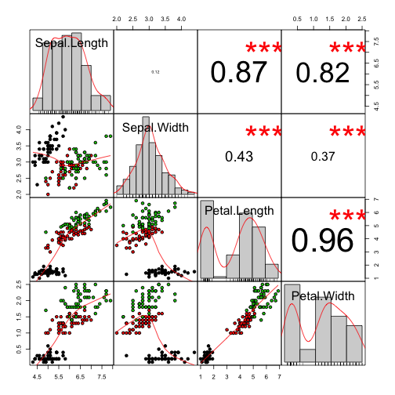
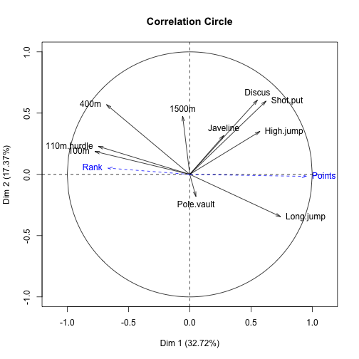

## For online viewers...

* Pressing 'p' toggles speaker notes (when available)
* Pressing 'f' toggles fullscreen viewing
* Pressing 'w' toggles widescreen
* Pressing 'o' toggles overview mode

N.B.:
The deck isn't completely standalone since I don't explain every step made as I did when actually presenting it.  That said I think the deck should be useful for anyone who wants to get a quick idea of what PCA is and the math behind it (I only take into account conventional PCA, not probabilistic interpretations).  I am inconsistent with some of my equations to make some of the algebra easier (all legal though!) which I explained during the actual presentation.  For people who want to go deeper and follow the math more closely I highly recommend the [tutorial by Jonathan Shlens](http://www.snl.salk.edu/~shlens/) which is where I got most of my derivations.

See the last slide of the deck for additional resources.

--- &twocol

## The ubiquitous & versatile PCA

*** left
* Dimensionality Reduction
 * Data Visualization
 * Learn faster
 * Lossy Data Compression
* Noise Reduction
* Exploration
* Feature Extraction
* Regression (Orthogonal)

*** right

* Unsupervised Learning Algorithm
 * Anomaly Detection (not the best)
 * Matching/Distance (e.g. [Eigenfaces](http://en.wikipedia.org/wiki/Eigenface), [LSI](http://en.wikipedia.org/wiki/Latent_semantic_indexing))
* K-Means
* Computer Graphics (e.g. Bounded Volumes)
* and many more across various domains...

---

## Majority of PCA tutorials...

1. Organize dataset as matrix.
1. Subtract off the mean for each measurement.
1. Calculate the covariance matrix and perform eigendecomposition.
1. Profit!

---

## Majority of PCA tutorials...

1. Organize dataset as matrix.
1. Subtract off the mean for each measurement.
1. Calculate the <del>covariance</del> correlation matrix and perform eigendecomposition.
1. Profit!

---

## Majority of PCA tutorials...

1. Organize dataset as matrix.
1. Subtract off the mean for each measurement.
1. <del>Calculate the <del>covariance</del> correlation matrix and perform eigendecomposition.</del>
1. Perform SVD.
1. Profit!


--- &vcenter


---

## The intuitive <del>Magic</del> Math behind PCA
* **Maximize the variance.**
* Minimize the projection error.

--- &vcenter

<span style="font-size:500%">$P_{m\times m}X_{m\times n} = Y_{m\times n}$</span>

*** pnotes
- N.B.: The X here is the tranpose of a typical design matrix..
  - See the Shlens paper for more info.
- Its goal is to extract the important information from the data and to express this information as a set of new orthogonal variables called principal components.
- A *linear* transformation!  This is a big assumption.
- *Is there another basis, which is a linear combination of the original basis, that best re-expresses our data set?*
- This transformation will become the *principal components* of X.
- What does the transformation boil down to?
 - Rotation and scale.. so how does that help us?
 - What should our P be doing?
 - What do we want our Y do look like?


--- &full_image local:signal_noise.png source:http://www.squidoo.com/noise-sources-signal-noise-ratio-snr-and-a-look-at-them-in-the-frequency-domain text_class:white

*** pnotes

- Every dataset has noise and signal... How can we bring out the signal?


--- &vcenter

<span style="font-size:500%">$SNR = \frac{\sigma^2_{signal}}{\sigma^2_{noise}}$</span>


--- &full_image local:svn.png


--- &twocol

## Rotate to maximize variance

*** left


*** right


--- &vcenter


*** pnotes
- The logo dimension and the text dimension are redunant and we can reduce it down to a single dimension. :)
- "In the real world" you are given datasets with redundanat data all the time...
 - Different kinds of measurements of same event (i.e. different types of brain scans)
 - Even duplicated features with transform + noise.
- We want a set of features, principal components, that are not redundant.  That way we can select the most "principal" ones and throw away the rest.
- Another name for redundancy is correlation.
 - We want to decorrelate the variables.

---


```r
library(PerformanceAnalytics)
chart.Correlation(iris[-5], bg = iris$Species, pch = 21)
```

 


---


```r
chart.Correlation(decorrelated.iris, bg = iris$Species, pch = 21)
```

 


*** pnotes

- Of course PCA doesn't work by looking at scatter plot pairs.
 - it needs to optimize against the quantified version of this... Covariance/Correlation.

--- &vcenter
## Variance and Covariance
\(
   \DeclareMathOperator{\stddev}{stddev}
   \DeclareMathOperator{\var}{var}
   \DeclareMathOperator{\cov}{cov}
   \DeclareMathOperator{\corr}{corr}
\)

<div class="build">
<table>
<thead>
<th></th>
<th>Mathematically Useful</th>
<th style="text-align:center">Intuitive</th>
</thead>
<tr>
<td>Dispersion</td>
<td>
\[
\begin{eqnarray*}
\sigma^2_A = \var(A) &=& E[(A - \mu_A)^2] \\
                     &=& \frac{1}{n} \sum_{i=1}^n (a_i - \mu_A)^2
\end{eqnarray*}
\]
</td>
<td>$$\sigma_A = \stddev(A) = \sqrt{\var(A)}$$</td>
</tr>
<tr>
<td>Relationship</td>
<td>
\[
\begin{eqnarray*}
\sigma_{AB} = \cov(A,B) &=& E[(A - \mu_A)(B - \mu_B)] \\
                     &=& \frac{1}{n} \sum_{i=1}^n (a_i - \mu_A)(b_i - \mu_B)
\end{eqnarray*}
\]
</td>
<td>$$\rho_{AB} = \frac{\sigma_{AB}}{\sigma_A\ \sigma_B} = \frac{\cov(AB)}{\stddev(A) \stddev(B)}$$
unitless measure $(-1.0..1.0)$
</td>
</tr>
</table>
<div> $$\cov(A,A) = \var(A)$$ </div>
<div> $\sigma_{AB}$ or $\rho_{AB}$ is $0$ if and only if $A$ and $B$ are uncorrelated.</div>
</div>

--- $vcenter

## Covariance Matrix

\[
\Sigma
= \begin{bmatrix}
 \sigma_{1,1} & \sigma_{1,2} & \cdots &  \sigma_{1,n} \\ \\
 \sigma_{2,1} & \sigma_{2,2} & \cdots &  \sigma_{2,n} \\ \\
 \vdots & \vdots & \ddots & \vdots \\ \\
 \sigma_{n,1} & \sigma_{n,2} & \cdots &  \sigma_{n,n} \\ \\
\end{bmatrix}
\]

<div class="build">
<div>Preprocess $X$ so that it has zero mean.
Now $\sigma_{AB} = \frac 1n \sum_{i=1}^n a_i b_i$</div>
<div style="font-size:300%">$$\Sigma_X = \frac{1}{n}X^TX$$</div>
</div>

---

```r
center <- function(x) x - mean(x)
iris.centered <- apply(as.matrix(iris[-5]), 2, center)
(t(iris.centered) %*% iris.centered)/(nrow(iris) - 1)
```

```
##              Sepal.Length Sepal.Width Petal.Length Petal.Width
## Sepal.Length      0.68569    -0.04243       1.2743      0.5163
## Sepal.Width      -0.04243     0.18998      -0.3297     -0.1216
## Petal.Length      1.27432    -0.32966       3.1163      1.2956
## Petal.Width       0.51627    -0.12164       1.2956      0.5810
```

----

```r
center <- function(x) x - mean(x)
m.centered <- apply(as.matrix(iris[-5]), 2, center)
(t(m.centered) %*% m.centered)/(nrow(iris) - 1)
```

```
##              Sepal.Length Sepal.Width Petal.Length Petal.Width
## Sepal.Length      0.68569    -0.04243       1.2743      0.5163
## Sepal.Width      -0.04243     0.18998      -0.3297     -0.1216
## Petal.Length      1.27432    -0.32966       3.1163      1.2956
## Petal.Width       0.51627    -0.12164       1.2956      0.5810
```


```r
cov(iris[-5])
```

```
##              Sepal.Length Sepal.Width Petal.Length Petal.Width
## Sepal.Length      0.68569    -0.04243       1.2743      0.5163
## Sepal.Width      -0.04243     0.18998      -0.3297     -0.1216
## Petal.Length      1.27432    -0.32966       3.1163      1.2956
## Petal.Width       0.51627    -0.12164       1.2956      0.5810
```


--- $vcenter

## What would our ideal $\Sigma_Y$ look like?
<span style="font-size:200%">
$$PX = Y$$
</span>
<div class="build">
<div>
\[
\Sigma_Y =
 \begin{bmatrix}
   \sigma^2_1\\
    & \sigma^2_2 & \Huge 0\\
    & & \ddots\\
    & \Huge 0 & & \sigma^2_n\\
 \end{bmatrix}
\]
i.e. $Y$ is decorrelated.
</div>
</div>

--- &vcenter

## Our goal...
<span style="font-size:250%">
Find some orthonormal matrix $P$ in $PX = Y$ such that $\Sigma_Y = YY^T$ is a diagonal matrix. The rows $Y_n$
of $P$ are the **principal components** of $X$.
</span>

<div class="build">
<span>
Note, that I transposed the design matrix (the data) so that covariance calculation is also reversed.
This will make our life easier...
</span>
</div>

---
## Rewrite $\Sigma_Y$ in terms of the unknown...
<span style="font-size:150%">
\[
\begin{eqnarray*}
\Sigma_Y &=& \frac 1n YY^T \\
         &=& \frac 1n (PX)(PX)^T \\
         &=& \frac 1n PXX^TP^T \\
         &=& P (\frac 1n XX^T) P^T \\
\Sigma_Y &=& P \Sigma_X P^T
\end{eqnarray*}
\]
</span>

--- &full_image local:strang.jpg text_class:white

## Spectral Theorem / Principal Axis Theorem

<div style="float:left;width:300px">
</div>
<div style="width:500px; float:right;">
<blockquote class="rectangle-speech-border">
<p>Every symmetric matrix has the eigendecomposition (i.e. can be diagnolized) of:
\[A = Q\Lambda Q^{-1} = Q\Lambda Q^T \]</p>
</blockquote>
</div>

--- $vcenter
## Remember, we are choosing what $P$ is...
<span style="font-size:200%">
$$PX = Y$$
</span>

--- $vcenter
## Remember, we are choosing what $P$ is...
<span style="font-size:175%">Let every row, $p_i$, be an eigenvector of $\Sigma_X$.
What this means is that $$P=Q^T$$ where $Q$ comes from the eigendecomposition of $\Sigma_X$.$$\Sigma_X = Q\Lambda Q^T$$</span>

---
## Turn the Algebra crank...
<span style="font-size:150%">
\[
\begin{eqnarray*}
\Sigma_Y &=& P \Sigma_X P^T \\
         &=& P(Q\Lambda Q^T) P^T \\
         &=& P(P^T\Lambda P) P^T \\
         &=& (PP^T)\Lambda (PP^T) \\
         &=& I\Lambda I \\
\Sigma_Y &=& \Lambda_{\Sigma_X} \\
\end{eqnarray*}
\]
</span>
<ul class="build fade">
 <li>The principal components are linear combinations of original features of $X$.</li>
 <li>The principal components of $X$ are the eigenvectors of $\Sigma_X$.</li>
 <li>The corresponding eigenvaules lie in $\Sigma_Y$ and represent the variance.</li>
</ul>

---
## Manual PCA in R

```r
iris.eigen = eigen(cov(iris.centered))
rownames(iris.eigen$vectors) = colnames(iris.centered)
colnames(iris.eigen$vectors) = c("PC1", "PC2", "PC3", "PC4")
iris.eigen
```

```
## $values
## [1] 4.22824 0.24267 0.07821 0.02384
## 
## $vectors
##                   PC1      PC2      PC3     PC4
## Sepal.Length  0.36139 -0.65659 -0.58203  0.3155
## Sepal.Width  -0.08452 -0.73016  0.59791 -0.3197
## Petal.Length  0.85667  0.17337  0.07624 -0.4798
## Petal.Width   0.35829  0.07548  0.54583  0.7537
```

---
## Make the contributions intuitive...

```r
iris.eigen$vectors^2
```

```
##                   PC1      PC2      PC3     PC4
## Sepal.Length 0.130600 0.431109 0.338759 0.09953
## Sepal.Width  0.007144 0.533136 0.357497 0.10222
## Petal.Length 0.733885 0.030058 0.005812 0.23025
## Petal.Width  0.128371 0.005697 0.297932 0.56800
```

---

```r
squared <- iris.eigen$vectors^2
sorted.squares <- squared[order(squared[, 1]), 1]
dotplot(sorted.squares, main = "Variable Contributions to PC1", cex = 1.5, col = "red")
```

 


--- &vcenter


```r
# library(FactoMineR); iris.pca <- PCA(iris, quali.sup=5)
plot(iris.pca, choix = "var", title = "Correlation Circle")
```

 

--- &vcenter


```r
# res.pca <- PCA(decathlon, quanti.sup=11:12, quali.sup = 13)
plot(res.pca, choix = "var", title = "Correlation Circle")
```

 


---
## What does the variance (eigenvaules) tell us?

```r
iris.eigen$values  # The variance for each corresponding PC
```

```
## [1] 4.22824 0.24267 0.07821 0.02384
```

<div class="build">
  
</div>

*** pnotes
-  We can easily reduce this down to two dimensions.

--- &vcenter


```r
# library(FactoMineR); iris.pca <- PCA(iris, quali.sup=5)
plot(iris.pca, habillage = 5, col.hab = c("green", "blue", "red"), title = "Dataset projected onto PC1-2 Subspace")
```

 


*** pnotes

- Talk about how a new observation would be projected in and then the distance could be measured for classification or other reasons.

---
## How many components should you keep?

Ratio of variance retained (e.g. 99% is common):

<span style="font-weight:200%">
$$\frac{\sum_{i=1}^k \sigma_i}{\sum_{i=1}^n \sigma_i}$$
</span>

```r
cumsum(iris.eigen$values/sum(iris.eigen$values))
```

```
## [1] 0.9246 0.9777 0.9948 1.0000
```


--- .scree_plot
## The Elbow Test
<div class="build">

</div>

```r
iris.prcomp <- prcomp(iris[-5], center = TRUE, scale = FALSE)
screeplot(iris.prcomp, type = "line", main = "Scree Plot")
```

 


---
## Kaiser Criterion
Keep only the components whose eigenvalue is larger than the average eigenvalue.
For a correlation PCA, this rule boils down to the standard advice to "keep only the eigenvalues larger than 1".

```r
eigen(cor(iris.centered))$values
```

```
## [1] 2.91850 0.91403 0.14676 0.02071
```


--- &vcenter
## Remeber, always...

<span style="font-size:800%;">CROSS<br/></br/>VALIDATE!</span>
<br />
PCA is overused and commonly misused, so always verify it is helping by cross validating.

--- .biplot
## Lots of other ways to aid interpretation...

```r
iris.prcomp <- prcomp(iris[-5], center = TRUE, scale = FALSE)
biplot(iris.prcomp)
```

 

--- &vcenter
## Learn more...
[](http://factominer.free.fr/book/)

--- &full_image local:danger_bilbo.jpg

*** pnotes
- Eigenvectors can freely rotate in the eigenspace.
- With repeated eigenvalues you can't rely on the ordering.
- Numerical differences in algorithms can effect the vectors.
- The eigenspace is what is really important.


--- &vcenter


*** pnotes
- While on the topic of LOTR... We haven't answered these questions yet. Now that you have understand the underlying intuition of PCA we can look at why using the correlation matrix would be required in some cases.
- We'll motivate this with an example...


---
## How will PCA perform?

```r
scaled.iris <- iris
scaled.iris$Petal.Length <- iris$Petal.Length/1000
scaled.iris$Petal.Width <- iris$Petal.Width/1000
scaled.iris$Sepal.Width <- iris$Sepal.Width * 10
```

<div style="visibility:hidden;">

```
## Warning: zero-length arrow is of indeterminate angle and so skipped
```

  

</div>

--- &twocol
## Scale Matters

*** left


*** right


---

## Correlation Matrix - Standardize the data


```r
# (In practice just use the built-in cor function)
standardize <- function(x) {
    centered <- x - mean(x)
    centered/sd(centered)
}
scaled.iris.standardized <- apply(as.matrix(scaled.iris[-5]), 2, standardize)
(t(scaled.iris.standardized) %*% scaled.iris.standardized)/(nrow(iris) - 1)
```

```
##              Sepal.Length Sepal.Width Petal.Length Petal.Width
## Sepal.Length       1.0000     -0.1176       0.8718      0.8179
## Sepal.Width       -0.1176      1.0000      -0.4284     -0.3661
## Petal.Length       0.8718     -0.4284       1.0000      0.9629
## Petal.Width        0.8179     -0.3661       0.9629      1.0000
```


*** pnotes
 - Mention Kernel PCA.. you can apply non-linear transforms to the data before as well.

---
## Ok, so why SVD? And how is it equivalent?

Short answer on why:
<ul class="build">
<li> SVD is more numerically stable</li>
<li> More efficient <br/>
 Especially when operating on a wide matrix.. you skip the step of calculating the covariance matrix
 </li>
<li>There are a lot of SVD algoritms and implementations to choose from</li>
</ul>

--- &full_image local:strang.jpg text_class:white
## "absolutely a high point of linear algebra"

<div style="float:left;width:300px">
</div>
<div style="width:500px; float:right;">
<blockquote class="rectangle-speech-border">
<p>Every matrix has the singular value decomposition (SVD) of:
\[A = UDV^T \]
</p>
</blockquote>
</div>

*** pnotes
- It really is a high point...
- If you don't already know SVD the details are out of scope for this presentation.. go watch Gilbert Strang's courses!
- I just will bring out one property that will aid in connecting it to PCA.

---
## Hey, $AA^T$ and $A^TA$ look familar...
\[
\begin{eqnarray*}
A &=& U DV^T \\
AA^T &=& UDV^T(UDV^T)^T \\
&=& UDV^TVD^T U^T \\
&=& UDD^TU^T \ \ (V^TV = I\ \mbox{since $V$, and $U$, are orthonormal}) \\
AA^T &=& U D^2 U^T \ \ (\mbox{since $D$ is a diagnol matrix}) \\
\end{eqnarray*}
\]
Recall that eigendecomposition for an orthonormal matrix is $A = Q \Lambda Q^T$.

Therefore $U$ are the eigenvectors of $AA^T$ and $D^2$ are the eigenvalues.

Likewise $V$ are the eigenvectors of $A^TA$ and $D^2$ are the eigenvalues.

---
## Turn the crank once more...
Let a new matrix $Y = \frac{1}{\sqrt{n}}X^T$ where each column of $Y$ is mean centered.

\[
\begin{eqnarray*}
Y^TY &=& (\frac{1}{\sqrt{n}}X^T)^T(\frac{1}{\sqrt{n}}X^T) \\
     &=& \frac 1n XX^T \\
Y^TY &=& \Sigma_X
\end{eqnarray*}
\]

So, if we run SVD on our $Y$ then $V$ will contain the eigenvectors of $\Sigma_X$... $X$'s principal components!
Our eigenvalues, the variances, will be $D^2$.

*** pnotes

You should really read Jon Shlens' Tutorial since this is where I stole this from.

---
## Tada!

```r
y <- iris.centered/sqrt(nrow(iris) - 1)
y.svd <- svd(y)
pcs <- y.svd$v
rownames(pcs) = colnames(iris.centered)
colnames(pcs) = c("PC1", "PC2", "PC3", "PC4")
pcs
```

```
##                   PC1      PC2      PC3     PC4
## Sepal.Length  0.36139 -0.65659  0.58203  0.3155
## Sepal.Width  -0.08452 -0.73016 -0.59791 -0.3197
## Petal.Length  0.85667  0.17337 -0.07624 -0.4798
## Petal.Width   0.35829  0.07548 -0.54583  0.7537
```

```r
y.svd$d^2  # variances
```

```
## [1] 4.22824 0.24267 0.07821 0.02384
```


--- &full_image local:Gandalf_the_White_returns.png #references
## References and Resources
1. Jon Shlens (versions 2.0 and 3.1), <cite>[Tutorial on Principal Component Analysis](http://www.snl.salk.edu/~shlens/)</cite>
1. H Abdi and L J Williams (2010), <cite>[Principal component analysis](http://www.universityoftexasatdallascomets.com/~herve/abdi-wireCS-PCA2010-inpress.pdf)</cite>
1. Andrew Ng (2009), <cite>[cs229 Lecture Notes 10](http://see.stanford.edu/materials/aimlcs229/cs229-notes10.pdf)</cite>
1. Andrew Ng (2009), <cite>[cs229 Lectures 14 & 15](http://see.stanford.edu/see/lecturelist.aspx?coll=348ca38a-3a6d-4052-937d-cb017338d7b1)</cite>
1. Christopher Bishop (2006), <cite>[Pattern Recognition and Machine Learning](http://research.microsoft.com/en-us/um/people/cmbishop/prml/)</cite>, section 12.1
1. Steve Pittard (2012), <cite>[Principal Components Analysis Using R](http://www.youtube.com/user/biorsph)</cite>
1. Quick-R, <cite>[Principal Components and Factor Analysis](http://www.statmethods.net/advstats/factor.html)</cite> (good pointers to additional R packages)
1. C Ding, X He (2004), <cite>[K-means Clustering via Principal Component Analysis](http://ranger.uta.edu/~chqding/papers/KmeansPCA1.pdf)</cite>
